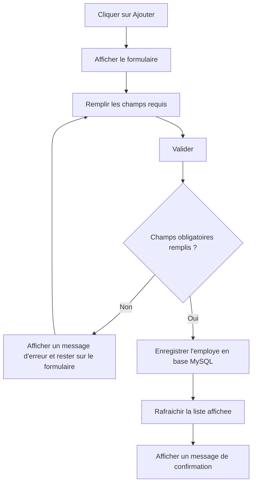
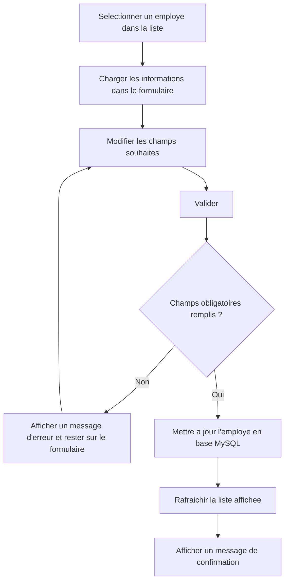
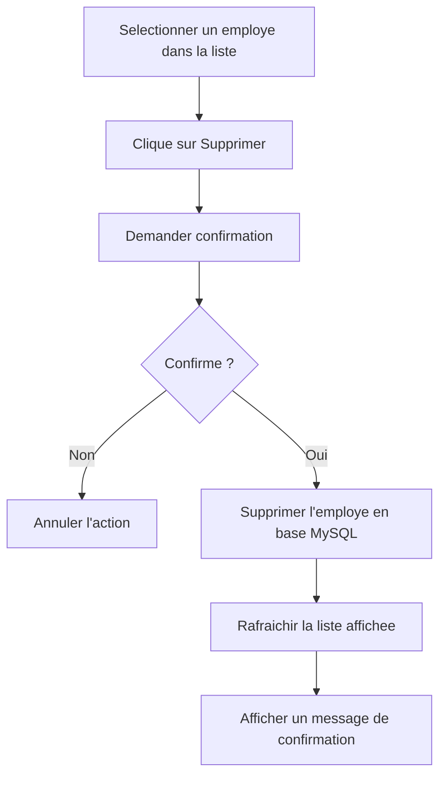
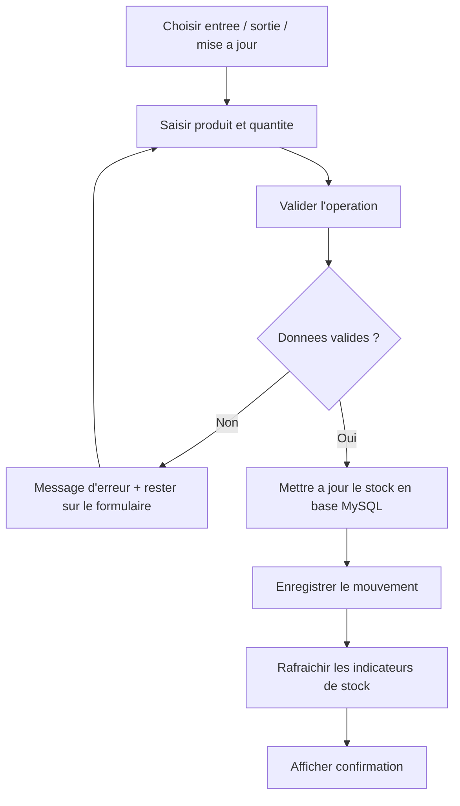
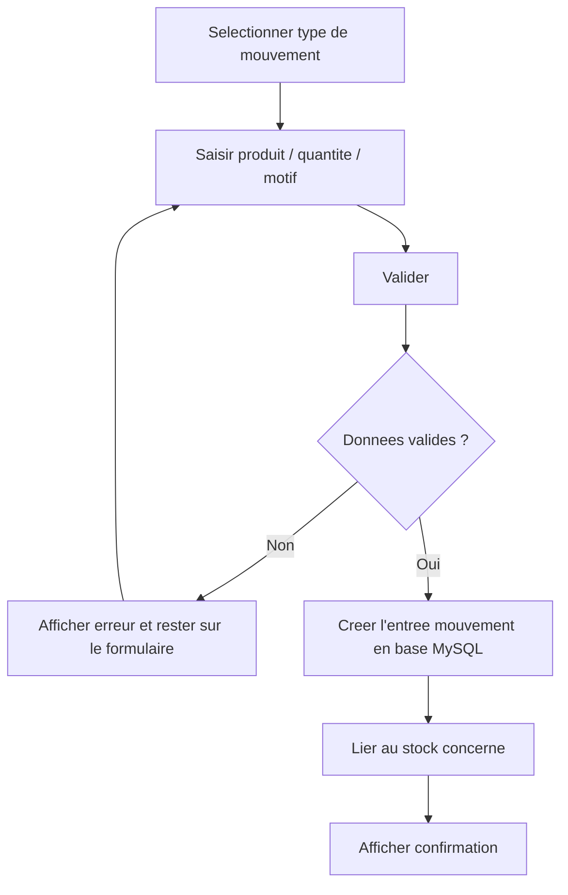
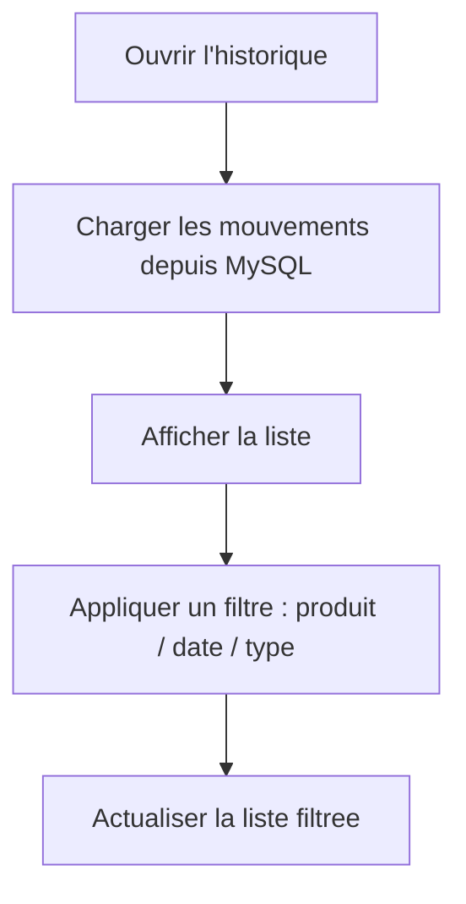
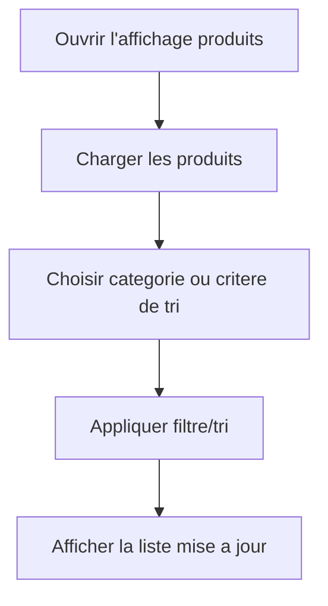
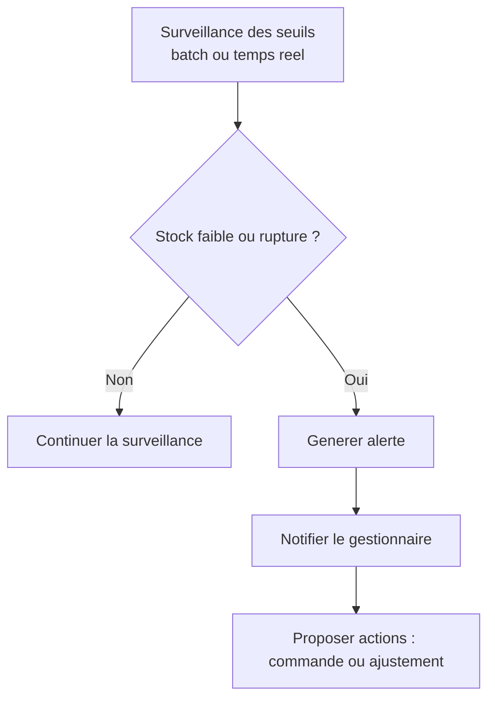
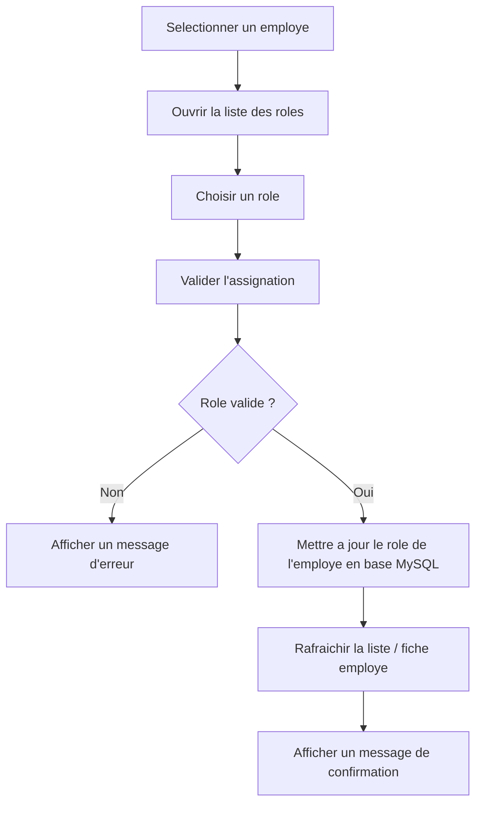
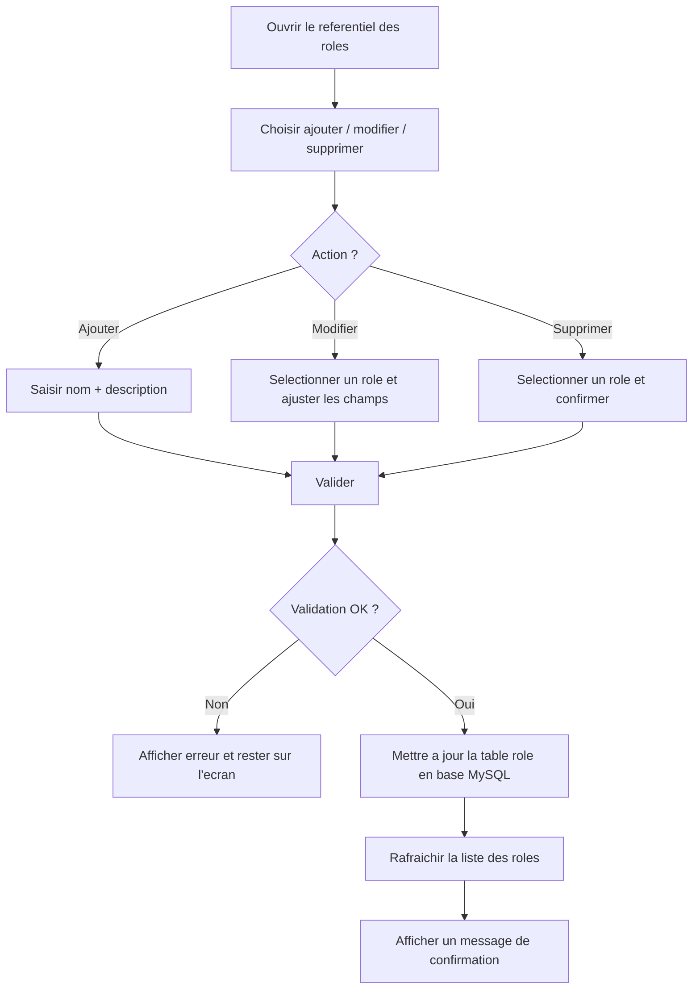

## Diagramme de cas d'utilisation

- `graph TD` pour rapprocher l'acteur et ses interactions.
- Sous-graphe pour encadrer le systeme de gestion.
- Liens d'extension sur les filtres/recherches pour montrer qu'ils prolongent la consultation.

## Flux UC1 (Ajouter un employe)

## Flux UC2 (Modifier un employe)

## Flux UC3 (Supprimer un employe)

## Flux UC4 (Gerer le stock)

## Flux UC5 (Enregistrer mouvement)

## Flux UC6 (Consulter l'historique des mouvements)

## Flux UC7 (Afficher produits par categorie / trier)

## Flux UC8 (Alertes stock)

## Flux UC9 (Assigner un role a un employe)

## Flux UC10 (Gerer les roles)

