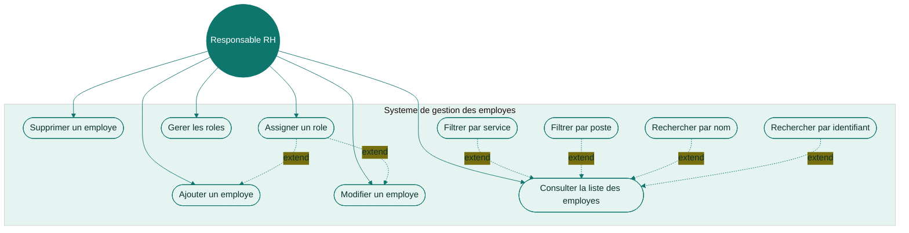
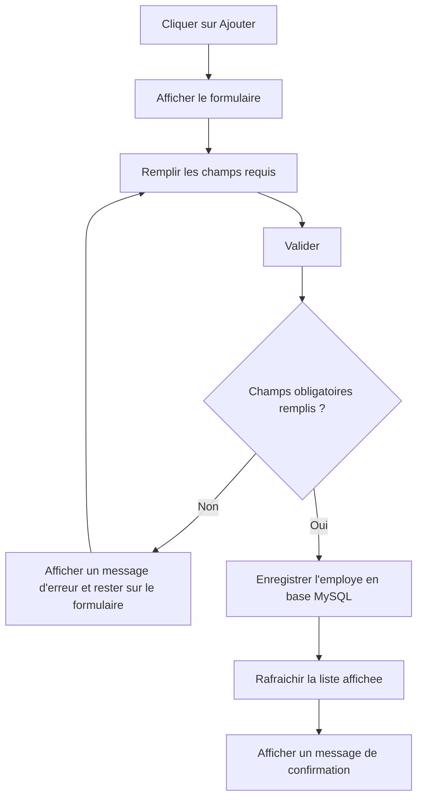
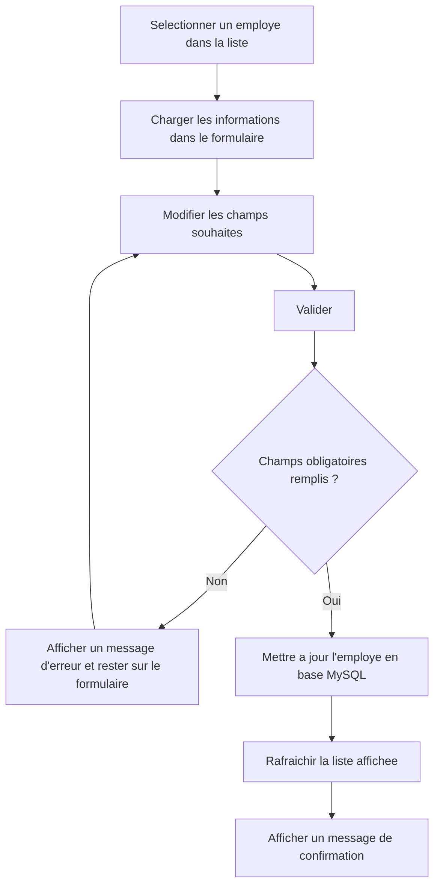
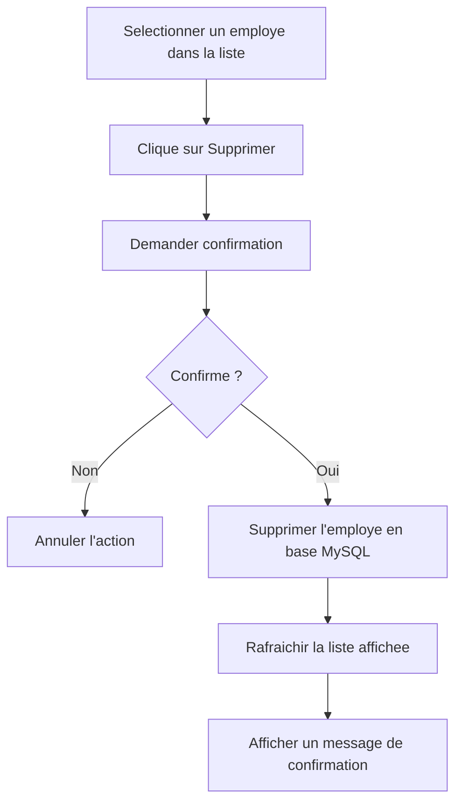

## Diagramme de cas d'utilisation

- `graph TD` pour rapprocher l'acteur et ses interactions.
- Sous-graphe pour encadrer le systeme de gestion.
- Liens d'extension sur les filtres/recherches pour montrer qu'ils prolongent la consultation.

## Flux UC1 (Ajouter un employe)

## Flux UC2 (Modifier un employe)

## Flux UC3 (Supprimer un employe)

