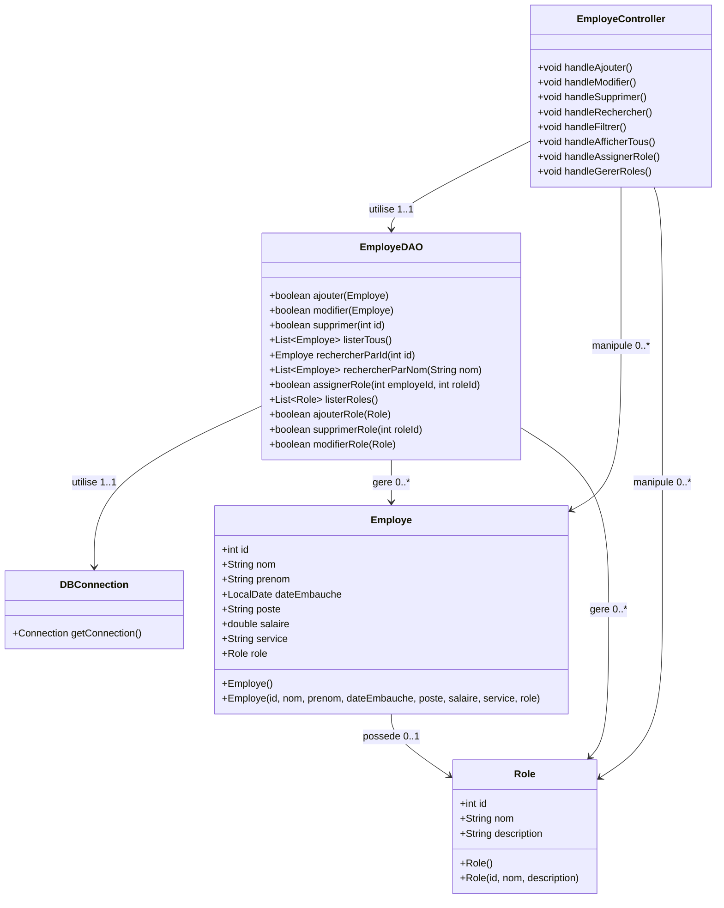

## 1) Besoin et entites
- L'entreprise veut informatiser la gestion des employes via une app JavaFX connectee a MySQL.
- Acteur principal : Responsable RH (unique utilisateur ciblant les operations CRUD).
- Entites cles :
  - Employe : id unique, nom, prenom, date d'embauche, poste, salaire, service, role.
  - Role : id, nom, description (referentiel des roles pour les affectations).

## 2) Cas d'utilisation et flux
- Cas : Ajouter, Modifier, Supprimer, Consulter la liste, Filtrer par service, Filtrer par poste, Rechercher par nom, Rechercher par identifiant, Assigner un role, Gerer les roles (CRUD sur le referentiel des roles).
- Diagramme : voir `docs/diagrammes/usecases.md`.
- Flux UC1 (Ajouter) :
  1. Clic Ajouter -> formulaire affiche.
  2. Saisie nom/prenom/date/poste/salaire/service (+ role si disponible).
  3. Validation -> controle champs obligatoires.
  4. Insertion MySQL -> rafraichissement liste -> confirmation. (Si champ vide -> erreur et refus).
- Flux UC2 (Modifier) :
  1. Selection dans la liste -> formulaire pre-rempli.
  2. Edition + validation.
  3. Update MySQL -> rafraichissement -> confirmation.
- Flux UC3 (Supprimer) :
  1. Selection -> clic Supprimer -> confirmation.
  2. Suppression MySQL -> rafraichissement -> confirmation.
- Flux UC4/5/6/7/8 (Consulter/Filtrer/Rechercher) :
  1. Ouverture ecran -> chargement complet depuis MySQL.
  2. Filtre service/poste applique -> affichage restreint.
  3. Recherche nom/id applique -> affichage des correspondances.
- Flux UC9 (Assigner un role) :
  1. Selection d'un employe -> ouverture d'une liste de roles.
  2. Choix du role -> validation.
  3. Mise a jour MySQL -> rafraichissement -> confirmation.
- Flux UC10 (Gerer les roles) :
  1. Acces au referentiel des roles.
  2. Ajouter/Modifier/Supprimer un role.
  3. Sauvegarde MySQL -> mise a jour des listes deroulantes -> confirmation.

## 3) Diagramme de classes


## 4) Base de donnees
- Schema cible : `gestion_employes`, tables `employe` et `role`.
- Script :
```sql
CREATE DATABASE gestion_employes;
USE gestion_employes;

CREATE TABLE role (
    id INT AUTO_INCREMENT PRIMARY KEY,
    nom VARCHAR(100) NOT NULL,
    description VARCHAR(255)
);

CREATE TABLE employe (
    id INT AUTO_INCREMENT PRIMARY KEY,
    nom VARCHAR(100) NOT NULL,
    prenom VARCHAR(100) NOT NULL,
    date_embauche DATE NOT NULL,
    poste VARCHAR(100) NOT NULL,
    salaire DOUBLE NOT NULL,
    service VARCHAR(100) NOT NULL,
    role_id INT,
    CONSTRAINT fk_role FOREIGN KEY (role_id) REFERENCES role(id)
);
```

## 5) Suite envisagee
- Coder la classe `Employe`, puis `DBConnection` (config MySQL).
- Implementer `EmployeDAO` pour CRUD + recherches/filtre + gestion/assignation des roles.
- Construire l'IHM JavaFX (FXML + controller `EmployeController`) et lier les handlers, incluant la selection de role.
- Ajouter validations (champs obligatoires, unicite id cote BD) et tests rapides sur les DAO.
